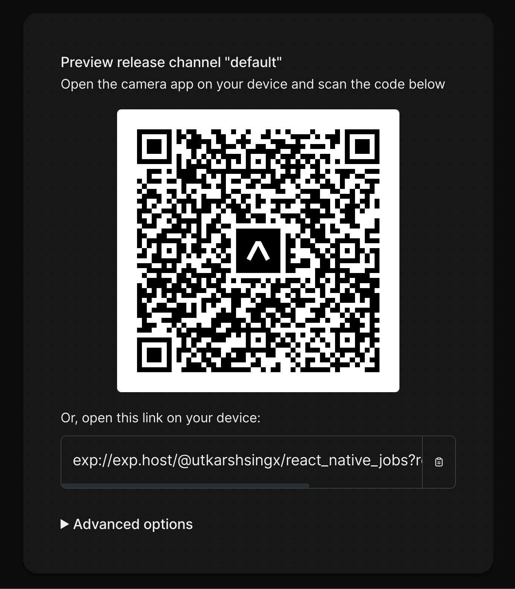

# JobFinder React Native App

JobFinder is a mobile application built with React Native that helps users find job opportunities based on their location and preferences. The app uses job search APIs to fetch job listings and allows users to filter them by location, job type, and other criteria.

## Features

- Search for job listings based on location and keywords
- Filter job listings by job type whether 'Full-time', 'Part-time' or a 'Contractor'.
- View job details and apply directly from the app
- Save favorite job listings for later viewing

## Screenshots

Here are some screenshots of the app:

 



## Contributing

Contributions to the website are welcome! If you find a bug or have an idea for a new feature, feel free to open an issue or submit a pull request.

## License

The website is licensed under the [MIT License](LICENSE). Feel free to use this website for your own purposes or modify it as needed.

## Technologies Used

- React Native
- React Navigation
- Axios
- JSearch API

## Getting Started

To get started with JobFinder, you'll need to have React Native installed on your computer. You can then clone the repository and install the dependencies:

```
git clone https://github.com/your-username/jobfinder-react-native.git
cd jobfinder-react-native
npm install
```

You'll also need to obtain API keys from job search APIs to use the app. Once you have your API keys, create a `.env` file in the project root directory and add your keys:

```
API_KEY=your-api-key
```

Finally, you can run the app on an emulator or device:

```
npx react-native run-android
```

## Contributing

Contributions to JobFinder are welcome! If you find a bug or have an idea for a new feature, feel free to open an issue or submit a pull request. Please read the [contributing guidelines](CONTRIBUTING.md) before getting started.

## License

JobFinder is licensed under the [MIT License](LICENSE). Feel free to use this app for your own purposes or modify it as needed.

